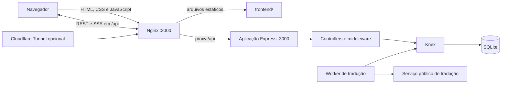

# Arquitetura do FitLife Sync

Este documento descreve o estado implementado na branch principal. Ele não
representa uma arquitetura futura nem pressupõe que os PRs de evolução já foram
incorporados.

## Visão geral

O sistema tem quatro processos de infraestrutura no Compose, mas somente um deles
implementa as regras de negócio. Por isso, a classificação correta é **monólito
modular conteinerizado**:

- `web`: Nginx para conteúdo estático e proxy reverso;
- `app`: uma aplicação Node.js/Express única;
- `translation-worker`: processo separado que consome a fila de traduções;
- `cloudflared`: túnel opcional para o Nginx.

Separar processos em contêineres não transforma a aplicação em microsserviços.
Não existem serviços de domínio independentes, contratos entre serviços ou
persistências separadas.

## Componentes

### Frontend

O frontend usa HTML, CSS e JavaScript sem framework. `frontend/index.html`
seleciona `desktop.html` ou `mobile.html` a partir do dispositivo e da largura da
tela. As duas interfaces compartilham os módulos JavaScript de API, sessão e
regras de apresentação.

O navegador chama somente caminhos relativos em `/api`. Em produção pelo
Compose, frontend e API ficam sob a mesma origem do Nginx.

### Nginx

O Nginx:

- serve o conteúdo de `frontend/`;
- encaminha `/api/` para o contêiner `app`;
- desabilita buffering e cache na conexão SSE e usa timeout de leitura de 75 segundos;
- normaliza o IP do visitante a partir de `CF-Connecting-IP` antes de encaminhá-lo;
- publica a porta `3000` somente no loopback do host.

O backend não é publicado diretamente pelo Compose. A porta `3000` declarada no
Dockerfile é interna à rede dos contêineres. Tráfego externo deve entrar pelo
Cloudflare Tunnel; o acesso direto em `127.0.0.1:3000` é reservado ao host.

### Backend

`backend/src/index.js` configura o Express e reúne todas as rotas. Os controllers
são separados por área funcional:

- `authController`: cadastro e autenticação;
- `studentController`: alunos e medidas;
- `workoutController`: treinos e exercícios de uma ficha;
- `exerciseController`: catálogo de exercícios;
- `chatController`: histórico, envio e streams SSE.

O middleware de autenticação valida o JWT armazenado em cookie `HttpOnly`, aplica
proteção CSRF nas requisições mutáveis e restringe rotas por perfil. Login e
cadastro possuem limitadores independentes, agrupados pelo IP canônico encaminhado
pelo Nginx. Essa separação melhora a organização interna, mas todos os módulos de
negócio continuam no mesmo processo e são implantados juntos.

### Persistência

O Knex acessa um único banco SQLite. No Compose, o arquivo fica em
`/app/data/database.sqlite`, dentro do volume nomeado `db-data`.

O schema é versionado em `backend/src/db/migrations`. Antes de abrir a porta HTTP,
a aplicação executa as migrations pendentes na ordem definida. O mesmo conjunto é
usado pelos comandos do Knex e pela suíte de testes.

As chaves de cadastro ficam na tabela `registration_keys` somente como hashes e
são consumidas na mesma transação que cria o personal. O arquivo legado
`keys_aut.json` não participa do fluxo atual.

O cadastro ainda adiciona o catálogo padrão de exercícios de forma síncrona. A
tradução, por outro lado, é executada pelo processo `translation-worker`, com
intervalos e retentativas configuráveis, sem compartilhar o ciclo de vida da API.

## Fluxos principais

### Requisição HTTP

1. O navegador solicita um caminho ao Nginx.
2. Arquivos estáticos são servidos diretamente.
3. Caminhos `/api` são encaminhados ao Express.
4. Middleware de autenticação e perfil protege a rota quando necessário.
5. O controller executa a regra e acessa o SQLite pelo Knex.
6. A resposta retorna pelo Nginx ao navegador.

### Chat em tempo real

1. O cliente carrega o histórico por uma rota HTTP autenticada.
2. O `EventSource` abre uma conexão persistente com `/api/chat/stream`.
3. O backend mantém as respostas SSE ativas em memória, agrupadas por usuário.
4. Durante períodos ociosos, o backend envia um comentário heartbeat a cada 25
   segundos; o Nginx aceita até 75 segundos sem atividade do upstream.
5. Ao salvar uma mensagem, o processo envia o evento às conexões locais do
   remetente e do destinatário.

As conexões ficam na memória de uma única instância. Escalar horizontalmente
exigiria um canal compartilhado, como pub/sub, e afinidade ou coordenação entre
réplicas.

## Limites arquiteturais

- **Banco:** somente SQLite está configurado e coberto pelos testes.
- **Escala:** banco em arquivo e streams em memória dificultam múltiplas réplicas;
  o worker também exige coordenação para execução concorrente.
- **Evolução do schema:** migrations Knex estão versionadas, mas mudanças
  destrutivas ainda exigem backup e plano explícito de rollback.
- **Jobs:** a tradução foi isolada, mas a carga inicial de aproximadamente 1.324
  exercícios ainda ocorre no caminho síncrono do cadastro.
- **Sessão:** JWT e CSRF usam cookies; a sessão `HttpOnly` não fica acessível ao
  JavaScript e o SSE não inclui token na URL.
- **PWA:** implementado manifesto PWA (`manifest.webmanifest`), ícones nativos e Service Worker (`sw.js`) com cache resiliente de assets estáticos e bypass das APIs.
- **Observabilidade:** não existe infraestrutura central de logs, métricas ou
  rastreamento distribuído.

Esses limites devem orientar PRs pequenos e independentes. Mudanças de banco,
sessão, worker ou implantação não devem ser apresentadas como simples alterações
de configuração.

## Convenções de texto

- Codificação: UTF-8.
- Final de linha versionado: LF.
- HTML: declarar `<meta charset="UTF-8">`.
- Arquivos binários e SQLite: não aplicar normalização de texto.

`.editorconfig` orienta os editores e `.gitattributes` garante a normalização no
Git. A exibição de `ðŸ` ou `ç` no PowerShell 5.1 geralmente indica leitura UTF-8
com a codificação padrão errada; use explicitamente `-Encoding UTF8` antes de
alterar o arquivo.
