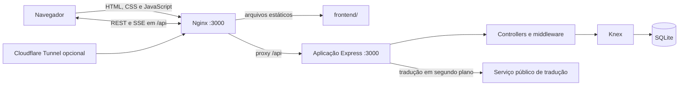

# Arquitetura do FitLife Sync

Este documento descreve o estado implementado na branch principal. Ele não
representa uma arquitetura futura nem pressupõe que os PRs de evolução já foram
incorporados.

## Visão geral

O sistema tem três processos de infraestrutura no Compose, mas somente um deles
implementa as regras de negócio. Por isso, a classificação correta é **monólito
modular conteinerizado**:

- `web`: Nginx para conteúdo estático e proxy reverso;
- `app`: uma aplicação Node.js/Express única;
- `cloudflared`: túnel opcional para o Nginx.

Separar processos em contêineres não transforma a aplicação em microsserviços.
Não existem serviços de domínio independentes, contratos entre serviços ou
persistências separadas.

## Componentes

### Frontend

O frontend usa HTML, CSS e JavaScript sem framework. `frontend/index.html`
seleciona `desktop.html` ou `mobile.html` a partir do dispositivo e da largura da
tela. As duas interfaces compartilham os módulos JavaScript de API, sessão e
regras de apresentação.

O navegador chama somente caminhos relativos em `/api`. Em produção pelo
Compose, frontend e API ficam sob a mesma origem do Nginx.

### Nginx

O Nginx:

- serve o conteúdo de `frontend/`;
- encaminha `/api/` para o contêiner `app`;
- desabilita buffering e cache na conexão SSE;
- expõe a porta `3000` do host.

O backend não é publicado diretamente pelo Compose. A porta `3000` declarada no
Dockerfile é interna à rede dos contêineres.

### Backend

`backend/src/index.js` configura o Express e reúne todas as rotas. Os controllers
são separados por área funcional:

- `authController`: cadastro e autenticação;
- `studentController`: alunos e medidas;
- `workoutController`: treinos e exercícios de uma ficha;
- `exerciseController`: catálogo de exercícios;
- `chatController`: histórico, envio e streams SSE.

O middleware de autenticação valida JWT e restringe rotas por perfil. Essa
separação melhora a organização interna, mas todos os módulos continuam no mesmo
processo e são implantados juntos.

### Persistência

O Knex acessa um único banco SQLite. No Compose, o arquivo fica em
`/app/data/database.sqlite`, dentro do volume nomeado `db-data`.

Na inicialização, `backend/src/database.js` verifica e cria tabelas diretamente.
Esse bootstrap atende a bancos vazios, mas não substitui migrations versionadas
para atualizar bancos existentes. O `knexfile.js` contém referências a diretórios
de migrations e seeds que ainda não existem na branch principal.

O backend também adiciona exercícios padrão para cada personal e inicia no mesmo
processo um loop de tradução. Cada réplica da API iniciaria seu próprio loop.

## Fluxos principais

### Requisição HTTP

1. O navegador solicita um caminho ao Nginx.
2. Arquivos estáticos são servidos diretamente.
3. Caminhos `/api` são encaminhados ao Express.
4. Middleware de autenticação e perfil protege a rota quando necessário.
5. O controller executa a regra e acessa o SQLite pelo Knex.
6. A resposta retorna pelo Nginx ao navegador.

### Chat em tempo real

1. O cliente carrega o histórico por uma rota HTTP autenticada.
2. O `EventSource` abre uma conexão persistente com `/api/chat/stream`.
3. O backend mantém as respostas SSE ativas em memória, agrupadas por usuário.
4. Ao salvar uma mensagem, o processo envia o evento às conexões locais do
   remetente e do destinatário.

As conexões ficam na memória de uma única instância. Escalar horizontalmente
exigiria um canal compartilhado, como pub/sub, e afinidade ou coordenação entre
réplicas.

## Limites arquiteturais

- **Banco:** somente SQLite está configurado e coberto pelos testes.
- **Escala:** banco em arquivo, streams em memória e worker interno dificultam
  múltiplas réplicas.
- **Evolução do schema:** não há migrations versionadas na branch principal.
- **Jobs:** seed e tradução compartilham o ciclo de vida da API.
- **Sessão:** o frontend atual mantém JWT no armazenamento do navegador e o SSE
  usa token na URL.
- **PWA:** não há manifest nem service worker.
- **Observabilidade:** não existe infraestrutura central de logs, métricas ou
  rastreamento distribuído.

Esses limites devem orientar PRs pequenos e independentes. Mudanças de banco,
sessão, worker ou implantação não devem ser apresentadas como simples alterações
de configuração.

## Convenções de texto

- Codificação: UTF-8.
- Final de linha versionado: LF.
- HTML: declarar `<meta charset="UTF-8">`.
- Arquivos binários e SQLite: não aplicar normalização de texto.

`.editorconfig` orienta os editores e `.gitattributes` garante a normalização no
Git. A exibição de `ðŸ` ou `ç` no PowerShell 5.1 geralmente indica leitura UTF-8
com a codificação padrão errada; use explicitamente `-Encoding UTF8` antes de
alterar o arquivo.
