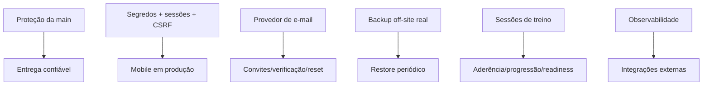

# Dashboard executivo e matriz de priorização — FitLife Sync

**Baseline verificada:** `5274051` (PR #186), em 05/08/2026.

Este documento contém uma única linha por requisito. O histórico detalhado dos PRs está em `CONTROLE_DE_IMPLEMENTACOES.md`.

## Critério de estado

- **Implementado:** critérios centrais entregues e cobertos por evidência automatizada na baseline.
- **Parcial:** existe fundação útil, mas falta integração externa, cobertura integral, QA operacional ou requisito relevante.
- **Não iniciado:** nenhuma implementação verificável.

Resumo: **8 implementados**, **50 parciais**, **0 não iniciados**, total de **58 requisitos únicos**.

## Ordem executiva recomendada

1. Ativar proteção da `main` e manter os cinco checks obrigatórios.
2. Configurar provedores reais: e-mail, backup S3/R2 e secret manager.
3. Executar E2E dos fluxos críticos em navegador e dispositivo mobile.
4. Fechar observabilidade, alertas e exercícios periódicos de restore.
5. Só então promover integrações comerciais/externas: cobrança, wearables, WhatsApp e geofencing.

## Matriz consolidada

| ID | Requisito | Estado | Evidência atual | Condição para concluir/evoluir |
|---|---|---|---|---|
| **SEC-01** | Proteção contra IDOR | **Parcial** | `idorMatrix.test.js`; ownership nos controllers | Reexecutar matriz para todas as rotas novas e padronizar 403/404 |
| **SEC-02** | Onboarding obrigatório | **Implementado** | migration `must_change_password`; `onboarding.test.js`; bloqueio frontend | QA E2E em navegador permanece como melhoria |
| **SEC-03** | Convites de aluno | **Parcial** | tokens expiráveis, claim e `studentInvitations.test.js` | Entrega real de e-mail, reenvio e operação ponta a ponta |
| **SEC-04** | Reset de senha do personal | **Parcial** | tokens com hash, expiração, rate limit, UI pública e testes | Configurar provedor de e-mail e validar entrega real |
| **SEC-05** | Verificação de e-mail | **Parcial** | migration, tokens, políticas e `emailVerification.test.js` | Entrega real, tela completa e política operacional |
| **SEC-06** | CSRF segregado | **Parcial** | cookies, origem/referer e testes HTTP | E2E WebView/Bearer em origem pública |
| **SEC-07** | Rate limit IP + conta | **Parcial** | chave combinada e hardening distribuído | Validar store compartilhado e múltiplas réplicas em produção |
| **SEC-08** | PAR-Q e termos | **Parcial** | versão server-side, gate 428, UI obrigatória e testes frontend/backend | Revisão jurídica/clínica, consulta profissional e auditoria de alterações |
| **SEC-09** | Segredos na CI | **Parcial** | Gitleaks, `.env` removido e validação de JWT | Confirmar rotação externa e secret manager |
| **DB-01** | Persistência física | **Parcial** | volume `/app/data`; teste de restore completo | Teste periódico após recriação real de containers/host |
| **DB-02** | WAL e busy timeout | **Implementado** | pragmas por conexão e teste de contenção | Monitorar `SQLITE_BUSY` em carga real |
| **DB-03** | Foreign keys | **Implementado** | pragma por conexão; órfãos, cascade e SET NULL testados | Reauditar cada nova migration |
| **DB-04** | Backup seguro | **Implementado** | `VACUUM INTO`, integridade, worker e restore | Manter exercício periódico de restore |
| **DB-05** | Backup off-site | **Parcial** | serviço criptografado, retenção, runbook e testes | Credenciais em secret manager e restore real S3/R2 agendado |
| **DB-06** | Expand/contract | **Parcial** | política CI, script e runbook | Validar deploy em duas versões/ambientes |
| **DB-07** | Constraints e índices | **Parcial** | índices e constraints existentes com testes | Revisar planos das consultas novas e constraints restantes |
| **DB-08** | Transações compostas | **Implementado** | aluno/treino atômicos e testes negativos de rollback | Aplicar padrão a novos fluxos compostos |
| **DB-09** | Precisão de domínio | **Parcial** | migration e `domainConstraints.test.js` | Eliminar floats/unidades ambíguas e migrar dados legados |
| **UX-01** | Paginação por cursor no chat | **Parcial** | API por cursor, carregamento progressivo aluno/personal e testes | QA E2E com histórico extenso em navegador e dispositivo real |
| **UX-02** | Virtual scrolling | **Parcial** | renderização virtualizada e teste estrutural | Benchmark/QA com catálogo grande e viewports reais |
| **UX-03** | Fuso horário | **Parcial** | módulo `datetime.js` e uso nas telas principais | Auditar todos os timestamps administrativos e legados |
| **UX-04** | Mídias órfãs/Base64 | **Parcial** | WebP, escrita atômica, limpeza e testes | Multipart, reconciliação global agendada e quota operacional |
| **UX-05** | Cache e cache-busting | **Parcial** | política Nginx e versionamento atual | Build com hashes de conteúdo e manifesto automático |
| **UX-06** | Optimistic locking | **Parcial** | campo version e conflitos em recursos selecionados | Cobrir todas as mutações e integrar `If-Match` no frontend |
| **UX-07** | WCAG 2.2 AA | **Parcial** | focus trap, teclado, reduced motion e testes | Auditoria manual de contraste, leitor de tela e fluxo completo |
| **UX-08** | Uploads e cotas | **Parcial** | MIME/assinatura, limites e `mediaQuotaService` | Multipart e reconciliação operacional de armazenamento |
| **BUS-01** | Sessões reais de treino | **Implementado** | sessões, progresso, status, histórico, UI e testes | Teste E2E em dispositivo e telemetria são melhorias |
| **BUS-02** | Status da ficha | **Concluído** | estados e controles desktop/mobile, confirmação, idempotência, transação e auditoria | Monitoramento operacional |
| **BUS-03** | Ciclo de vida do aluno | **Concluído** | estados atuais no middleware, políticas read-only/bloqueio, exceções essenciais e UX desktop/mobile | Monitorar tentativas bloqueadas e revisar políticas operacionais |
| **BUS-04** | Anamnese | **Concluído** | aba desktop/mobile, versões imutáveis, privacidade e auditoria transacional | Validação clínica dos campos permanece operacional |
| **BUS-05** | Aderência semanal | **Concluído** | meta configurável, período inclusivo, API, UI e auditoria | Validar metas com operação real |
| **BUS-06** | Progressão de carga | **Concluído** | volume, histórico, recordes, Epley e referência contextual | Validação profissional da referência estimada |
| **BUS-07** | Temporizador/sessão ativa | **Concluído funcionalmente** | atividade, timer, recuperação offline, estado de sincronização e métricas | QA Android/iOS em background e múltiplos dispositivos |
| **BUS-08** | Offline e idempotência | **Parcial** | fluxo de execução coberto por IndexedDB, identidade da requisição, conflitos, retenção e telemetria visual | Expandir por domínio somente onde houver contrato seguro de reconciliação |
| **BUS-09** | Chaves de cadastro CLI | **Implementado** | criar, listar/revogar e testes do serviço | Governança operacional contínua |
| **BUS-10** | Ciclo de vida do chat | **Implementado** | editar/excluir, UI e eventos SSE consolidados até PR #186 | Política de retenção pode evoluir |
| **BUS-11** | Indicador digitando | **Concluído funcionalmente** | SSE, frontend acessível, debounce, métricas e integração HTTP real | QA de latência percebida em rede/dispositivos reais |
| **BUS-12** | Inativação e filtros | **Concluído** | filtros server-side, abas, confirmação acessível, estados e histórico visual de auditoria | Políticas de acesso por status permanecem em BUS-03 |
| **BUS-13** | Periodização | **Concluído funcionalmente** | editor, auditoria, visualização do aluno e integração com progressão | QA biomecânica profissional permanece operacional |
| **BUS-14** | Governança do catálogo | **Parcial** | escopo/customização e deduplicação inicial | Moderação global e deduplicação automática em lote |
| **OPS-01** | Subscriptions | **Parcial** | schema, guard e controller | Gateway real, webhooks idempotentes e ciclo financeiro |
| **OPS-02** | Equipes Head/Junior | **Parcial** | schema e endpoints básicos | Convites, permissões granulares, bibliotecas e split |
| **OPS-03** | Acesso multiprofissional | **Parcial** | consentimentos e endpoints | Convites, exames, UX e auditoria operacional |
| **OPS-04** | Wearables | **Parcial** | foundation de ingestão e testes | OAuth real, jobs incrementais e conectores de provedores |
| **OPS-05** | CRM/NPS | **Parcial** | serviço, controller e testes | Agendamento/entrega reais, métricas e preferências |
| **OPS-06** | Geofencing | **Parcial** | schema, controller e testes | GPS/Wi-Fi real, antifraude, ICS e UX |
| **OPS-07** | Readiness | **Parcial** | check-in, regras, gate e testes | Validação clínica, lembretes e acompanhamento longitudinal |
| **OPS-08** | Notificações | **Parcial** | centro/preferências e testes frontend/backend | Workers e canais reais push/WhatsApp/e-mail |
| **OPS-09** | LGPD | **Parcial** | exportação/anonimização e testes | Processamento assíncrono, criptografia e confirmação |
| **OPS-10** | Liveness/readiness | **Concluído funcionalmente** | probes separadas, falhas de banco/migrations, métricas e healthcheck canônico | Exercício de indisponibilidade no ambiente de deploy |
| **OPS-11** | Sessões por dispositivo | **Concluído funcionalmente** | painel acessível, limite/ociosidade, retenção, IP mascarado, refresh vinculado e logout global | Monitorar políticas e validar dispositivos reais |
| **OPS-12** | Impersonation | **Parcial** | eventos auditáveis e controllers | Aprovação, escopo restrito e banner de suporte |
| **OPS-13** | Observabilidade | **Parcial** | logs JSON, redaction, RED por rota normalizada, SQLite busy e exportação Prometheus protegida | Coletor persistente, alertas/SLO e correlação distribuída |
| **OPS-14** | CI/CD | **Parcial** | 5 checks aprovados: backend, frontend, secrets, migrations e policy | Proteção da main, deploy/rollback e ambientes segregados |
| **MOB-01** | Wrapper Capacitor | **Parcial** | configuração e testes de estrutura | Build assinado e validação em Android/iOS reais |
| **MOB-02** | Base URL dinâmica | **Parcial** | resolver Capacitor e testes | Configuração por ambiente e distribuição real |
| **MOB-03** | CORS WebView | **Parcial** | origens Capacitor permitidas com testes | Validar aparelhos, builds release e política por ambiente |
| **MOB-04** | Secure Storage | **Parcial** | bridge, refresh token e testes | Plugin nativo real, migração e testes em dispositivo |

## Dependências críticas

## Evidência de baseline

- 36 migrations versionadas.
- 40 arquivos de teste backend.
- 17 arquivos de teste frontend.
- CI do commit `5274051`: Backend, Frontend and infrastructure, Secret scan, Migration policy e CI policy aprovados.
- Nenhum PR aberto na data da reconciliação.
- A existência de migration/controller não é tratada como prova de operação externa; por isso a maioria dos itens permanece parcial.
