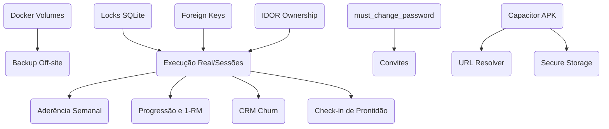

# Dashboard Executivo e Matriz de Priorização (FitLife Sync)

Este documento atua como o painel executivo para controle de progresso e roadmap de desenvolvimento, organizando todas as lacunas identificadas por identificadores estáveis e dependências lógicas.

**Data-base da validação:** 29/07/2026. Os estados refletem inspeção do `HEAD` do repositório e devem ser revistos quando código ou infraestrutura mudarem.

**Legenda de estado:** **Implementado** = código e evidência automatizada compatíveis com o escopo atual; **Parcial** = existe implementação útil, mas falta parte do requisito ou cobertura; **Não Iniciado** = não foi encontrada implementação verificável. As horas são estimativas iniciais, não compromissos, e devem ser recalibradas após refinamento técnico.

---

## 1. Tabela de Status Executivo

| ID | Requisito | Prioridade | Estado | Esforço (h) | Risco | Responsável |
|---|---|---|---|---|---|---|
| **SEC-01** | Proteção contra IDOR | 10/10 | **Parcial** | 8h | Alto | Backend | #
| **SEC-02** | Onboarding (`must_change_password`) | 9/10 | **Implementado** | 12h | Médio | Fullstack |
| **SEC-03** | Convites de Aluno com Expiração | 9/10 | **Parcial** | 16h | Médio | Fullstack |
| **SEC-04** | Reset de Senha do Personal | 8/10 | **Não Iniciado** | 12h | Médio | Backend | #
| **SEC-05** | Verificação de E-mail | 7/10 | **Parcial** | 8h | Baixo | Backend |
| **SEC-06** | CSRF Segregado | 9/10 | **Parcial** | 6h | Médio | Backend |
| **SEC-07** | Rate Limit IP + Conta | 8/10 | **Parcial** | 4h | Médio | Backend |
| **SEC-08** | PAR-Q e Assinatura Eletrônica | 8/10 | **Não Iniciado** | 16h | Médio | Fullstack |
| **SEC-09** | Validação/Rotação de Segredos na CI | 10/10 | **Parcial** | 8h | Alto | DevOps | #
| **DB-01** | Persistência (Docker Volumes) | 10/10 | **Parcial** | 4h | Alto | DevOps | #
| **DB-02** | Concorrência SQLite (WAL) | 9/10 | **Implementado** | 4h | Médio | Backend | #
| **DB-03** | Foreign Keys sqlite (`foreign_keys=ON`) | 10/10 | **Parcial** | 4h | Alto | Backend |#
| **DB-04** | Backup Seguro (`VACUUM INTO`) | 9/10 | **Implementado** | 8h | Médio | Backend |
| **DB-05** | Backup Off-Site e Restore | 10/10 | **Não Iniciado** | 16h | Alto | DevOps | #
| **DB-06** | Deploy expand/contract | 10/10 | **Não Iniciado** | 12h | Alto | DevOps |
| **DB-07** | Constraints e Índices | 9/10 | **Parcial** | 6h | Médio | Backend |
| **DB-08** | transação em Cadastros Compostos | 10/10 | **Não Iniciado** | 8h | Alto | Backend | #
| **DB-09** | Precisão e Restrições de Domínio | 8/10 | **Não Iniciado** | 12h | Médio | Backend |
| **UX-01** | Paginação por Cursor no Chat | 8/10 | **Parcial** | 12h | Médio | Fullstack |
| **UX-02** | Virtual Scrolling no Catálogo | 8/10 | **Parcial** | 16h | Alto | Frontend |
| **UX-03** | Fuso Horário Local (UTC) | 9/10 | **Parcial** | 10h | Médio | Fullstack |
| **UX-04** | Bloqueio Base64 e `fs.unlink` | 8/10 | **Parcial** | 8h | Baixo | Backend |
| **UX-05** | Cache Nginx e Cache-Busting | 7/10 | **Parcial** | 8h | Baixo | DevOps |
| **UX-06** | Concorrência (Optimistic Locking) | 7/10 | **Parcial** | 12h | Médio | Backend |
| **UX-07** | Acessibilidade WCAG 2.2 AA | 8/10 | **Parcial** | 20h | Médio | Frontend |
| **UX-08** | Hardening de Uploads / Cotas | 8/10 | **Parcial** | 8h | Alto | Backend |
| **BUS-01** | Execução Real de Treino (Sessions) | 10/10 | **Não Iniciado** | 24h | Alto | Fullstack | #
| **BUS-02** | Status da Ficha (Draft/Published) | 9/10 | **Parcial** | 12h | Baixo | Fullstack |
| **BUS-03** | Ciclo de Vida do Aluno/Vínculo | 9/10 | **Parcial** | 16h | Médio | Fullstack |
| **BUS-04** | Anamnese Clínica (`Assessments`) | 9/10 | **Parcial** | 16h | Baixo | Fullstack |
| **BUS-05** | Aderência Semanal Analítica | 8/10 | **Não Iniciado** | 12h | Médio | Backend |
| **BUS-06** | Progressão de Carga e 1-RM | 7/10 | **Parcial** | 16h | Médio | Fullstack |

bus/bus-08-offline-idempotency
| **BUS-07** | Temporizador e Sessão Ativa | 7/10 | **Não Iniciado** | 14h | Baixo | Frontend |
| **BUS-08** | Fila IndexedDB e Idempotency | 8/10 | **Parcial** | 20h | Alto | Fullstack |
| **BUS-07** | Temporizador e Sessão Ativa | 7/10 | **Parcial** | 14h | Baixo | Frontend |
| **BUS-08** | Fila IndexedDB e Idempotency | 8/10 | **Não Iniciado** | 20h | Alto | Frontend |
| **BUS-09** | Chaves de Cadastro via CLI | 10/10 | **Parcial** | 8h | Baixo | Backend |
| **BUS-10** | Edição/Exclusão/Leitura de Chat | 8/10 | **Não Iniciado** | 12h | Médio | Fullstack |
| **BUS-11** | Indicador "Digitando..." via SSE | 5/10 | **Não Iniciado** | 8h | Baixo | Fullstack |
| **BUS-12** | Inativação e Abas de Alunos | 8/10 | **Parcial** | 8h | Baixo | Fullstack |
| **BUS-13** | Periodização Biomecânica | 6/10 | **Não Iniciado** | 20h | Alto | Backend |
| **BUS-14** | Governança do Catálogo | 7/10 | **Não Iniciado** | 16h | Médio | Backend |
| **OPS-01** | Subscriptions e Bloqueio 402 | 7/10 | **Não Iniciado** | 16h | Alto | Backend |
| **OPS-02** | Gestão de Equipe (Head/Junior) | 6/10 | **Não Iniciado** | 30h | Alto | Backend |
| **OPS-03** | Acesso Multiprofissional | 5/10 | **Não Iniciado** | 24h | Médio | Fullstack |
| **OPS-04** | Integração com Wearables | 4/10 | **Não Iniciado** | 40h | Alto | Fullstack |
| **OPS-05** | Alertas CRM de Churn e NPS | 5/10 | **Não Iniciado** | 16h | Baixo | Backend |
| **OPS-06** | Check-ins por Geofencing | 4/10 | **Não Iniciado** | 30h | Alto | Fullstack |
| **OPS-07** | Check-in de Prontidão (Readiness) | 5/10 | **Não Iniciado** | 12h | Baixo | Fullstack |
| **OPS-08** | Central de Notificações | 5/10 | **Não Iniciado** | 16h | Baixo | Fullstack |
| **OPS-09** | Exportação e Anonimização LGPD | 9/10 | **Parcial** | 14h | Alto | Backend |
| **OPS-10** | Health Checks Liveness/Readiness | 8/10 | **Parcial** | 8h | Baixo | DevOps |
| **OPS-11** | Sessões por Dispositivo | 6/10 | **Não Iniciado** | 18h | Médio | Backend |
| **OPS-12** | Impersonation Auditável | 6/10 | **Não Iniciado** | 14h | Alto | Backend |
| **OPS-13** | Logs JSON, Redaction e Métricas | 8/10 | **Não Iniciado** | 16h | Médio | DevOps |
| **OPS-14** | CI/CD Obrigatória | 9/10 | **Não Iniciado** | 24h | Alto | DevOps | #
| **MOB-01** | Wrapper Híbrido (Capacitor) | 7/10 | **Não Iniciado** | 20h | Alto | Mobile |
| **MOB-02** | Resolução Dinâmica Base URL | 8/10 | **Não Iniciado** | 6h | Baixo | Mobile |
| **MOB-03** | CORS para WebViews | 8/10 | **Não Iniciado** | 6h | Baixo | Backend |
| **MOB-04** | Secure Storage | 7/10 | **Não Iniciado** | 10h | Alto | Mobile |

---

## 2. Dependências entre Tarefas (Ordem Lógica)

As tarefas devem respeitar as seguintes dependências técnicas para evitar retrabalho de arquitetura:

---

## 3. Matriz de Mapeamento Técnico de Código

Esta matriz correlaciona cada ID de requisito aos arquivos de implementação e testes do repositório:

| ID | Arquivo Atual | Teste Atual | Teste Faltante |
|---|---|---|---|
| **SEC-01** | `../backend/src/controllers/studentController.js`, `workoutController.js`, `chatController.js` | `../backend/src/tests/api.test.js`, `chatController.test.js` | `Matriz IDOR negativa cobrindo toda rota com recurso de aluno` |
| **SEC-02** | `../backend/src/db/migrations/202607290001_add_must_change_password.js`, `authController.js`, `studentController.js`, `profileController.js`, `middleware/auth.js`, `frontend/js/app.js`, `profile.js` | `../backend/src/tests/onboarding.test.js`, `api.test.js`, `passwordReset.test.js` | `Teste E2E de navegador para impedir fechamento do modal obrigatório` |
| **SEC-03** | `../backend/src/db/migrations/202607290002_create_student_invitations.js`, `studentController.js`, `middleware/validateRequest.js`, `index.js` | `../backend/src/tests/studentInvitations.test.js`, `migrations.test.js` | `Entrega de e-mail e endpoint de aceite que cria a conta do aluno` |
| **SEC-05** | `../backend/src/db/migrations/202607290003_add_email_verification.js`, `authController.js`, `emailDeliveryService.js`, `index.js` | `../backend/src/tests/emailVerification.test.js`, `migrations.test.js` | `Bloqueios de política no reset/onboarding e tela de confirmação` |
| **SEC-06** | `../backend/src/middleware/auth.js`, `httpSecurity.js` | `../backend/src/tests/httpSecurity.test.js`, `api.test.js` | `Fluxo mobile/Bearer e teste E2E em origem pública` |
| **SEC-07** | `../backend/src/middleware/httpSecurity.js` | `../backend/src/tests/httpSecurity.test.js` | `Chave combinada por IP + e-mail, inclusive múltiplos IPs` |
| **DB-01** | `../docker-compose.yml` | - | `Checagem física de persistência pós container restart` |
| **DB-02** | `../backend/knexfile.js` | `../backend/src/tests/auth-config.test.js` | `Teste de contenção com escritas paralelas` |
| **DB-03** | `../backend/knexfile.js` | `../backend/src/tests/migrations.test.js` | `Confirmar pragma em cada conexão e rejeitar registro órfão` |
| **DB-04** | `../backend/src/scripts/backupDatabase.js`, `workers/backupWorker.js` | `../backend/src/tests/backupDatabase.test.js`, `backupWorker.test.js` | `Restore periódico em ambiente isolado` |
| **DB-07** | `../backend/src/db/migrations/202607140002_add_query_indexes.js` | `../backend/src/tests/indexes.test.js` | `Constraints de domínio e planos das consultas futuras` |
| **UX-07** | `../frontend/desktop.html`, `mobile.html`, `css/` | `../frontend/tests/strict-csp.test.js`, `safe-dom.test.js` | `Auditoria WCAG 2.2 AA automatizada e manual` |
| **UX-08** | `../backend/src/services/avatarService.js`, `../nginx.conf` | `../backend/src/tests/api.test.js` | `Quota por usuário/tenant e persistência/reconciliação de arquivos` |
| **BUS-04** | `../backend/src/db/migrations/202607290009_create_student_assessments.js`, `assessmentController.js`, `index.js` | `../backend/src/tests/migrations.test.js`, `api.test.js` | `Tela de anamnese, edição/versionamento e auditoria clínica` |
| **OPS-10** | `../backend/src/index.js` | `../backend/src/tests/api.test.js` | `Separar liveness de readiness verificando migrations` |
| **OPS-09** | `../backend/src/controllers/complianceController.js`, `../backend/src/index.js` | `../backend/src/tests/complianceController.test.js` | `Exportação assíncrona/criptografada, retenção, fila de exclusão e revisão jurídica LGPD` |
| **UX-01** | `../backend/src/controllers/chatController.js`, `../backend/src/index.js` | `../backend/src/tests/api.test.js` | `Carregar páginas anteriores no frontend e botão/scroll de histórico` |
| **UX-02** | `../frontend/js/personal.js`, `../frontend/css/style.css`, `mobile.css` | `../frontend/tests/strict-csp.test.js` | `Medição visual de altura por viewport e QA em catálogo muito grande` |
| **UX-03** | `../frontend/js/datetime.js`, `personal.js`, `student.js`, páginas HTML | `../frontend/tests/strict-csp.test.js` | `Normalizar respostas legadas do backend e auditoria dos demais timestamps administrativos` |
| **UX-04** | `../backend/src/services/avatarService.js`, `profileController.js` | `../backend/src/tests/avatarService.test.js`, `api.test.js` | `Quota operacional configurável, reconciliação periódica global e upload multipart` |
| **UX-05** | `../nginx.conf`, `../frontend/index.html`, `desktop.html`, `mobile.html` | `../frontend/tests/strict-csp.test.js` | `Build automatizado que gera hashes de conteúdo e impede referências a assets removidos` |
| **UX-06** | `../backend/src/db/migrations/202607290006_add_optimistic_versions.js`, `profileController.js`, `exerciseController.js` | `../backend/src/tests/migrations.test.js`, `api.test.js` | `Aplicar If-Match a todas as mutações editáveis e enviar versão pelo frontend` |
| **UX-07** | `../frontend/css/style.css`, `desktop.html`, `mobile.html` | `../frontend/tests/strict-csp.test.js` | `Auditoria manual com leitor de tela, contraste medido e navegação completa por teclado` |
| **BUS-02** | `../backend/src/db/migrations/202607290007_add_workout_status.js`, `workoutController.js`, `index.js` | `../backend/src/tests/migrations.test.js`, `api.test.js` | `Controles de status no frontend e auditoria de publicação` |
| **BUS-03** | `../backend/src/db/migrations/202607290008_add_student_lifecycle_status.js`, `studentController.js`, `index.js` | `../backend/src/tests/migrations.test.js`, `api.test.js` | `Aplicar políticas de acesso para contas suspensas/arquivadas e abas de status no frontend` |
| **BUS-06** | `../backend/src/controllers/progressionController.js`, `index.js` | `../backend/src/tests/api.test.js` | `Sugestão visual no frontend e cálculo de 1-RM por fórmula validada` |
| **BUS-12** | `../backend/src/controllers/studentController.js`, `../frontend/js/personal.js`, `desktop.html`, `mobile.html` | `../backend/src/tests/api.test.js`, `../frontend/tests/strict-csp.test.js` | `Endpoint com filtro persistido e confirmação/auditoria das transições de status` |
| **BUS-04** | `../backend/src/db/migrations/202607290009_create_student_assessments.js`, `assessmentController.js`, `index.js` | `../backend/src/tests/migrations.test.js`, `api.test.js` | `Tela de anamnese, edição/versionamento e auditoria clínica` |
 bus/bus-08-offline-idempotency
| **BUS-08** | `../backend/src/db/migrations/202607290011_create_idempotency_keys.js`, `../backend/src/middleware/idempotency.js`, `../frontend/js/api.js` | `../backend/src/tests/migrations.test.js`, `../backend/src/tests/workoutSessions.test.js`, `../frontend/tests/strict-csp.test.js` | `Instrumentar fila para todos os fluxos offline e política de retenção/limpeza` |
| **BUS-07** | `../backend/src/db/migrations/202607290010_add_session_activity.js`, `workoutSessionController.js`, `index.js` | `../backend/src/tests/migrations.test.js`, `workoutSessions.test.js` | `Temporizador visual e recuperação automática da sessão no frontend` |
| **UX-08** | `../backend/src/services/avatarService.js`, `mediaQuotaService.js`, `profileController.js`, `exerciseController.js`, `nginx.conf` | `../backend/src/tests/avatarService.test.js`, `mediaQuotaService.test.js`, `httpSecurity.test.js` | `Multipart para novos uploads e reconciliação global agendada` |

---

## 4. Critérios de Aceite para Requisitos P0 (Prioridades 9 e 10)

### [SEC-01] Proteção contra IDOR
*   *Critério 1*: Toda rota que receba ou derive `studentId`, `workoutId`, `exerciseId`, `messageId` ou `userId` deve resolver o proprietário no servidor e retornar `403 Forbidden` para acesso cruzado autenticado, sem revelar se o recurso existe.
*   *Critério 2*: Uma matriz automatizada deve executar Personal A contra recursos do Personal B em detalhes, medidas, treinos, exercícios, chat, avatar e futuras avaliações. Eventos de segurança devem ser auditados com minimização e rate limit, sem registrar conteúdo sensível.

### [SEC-02] Onboarding compulsório
*   *Critério 1*: Login de conta com `must_change_password = true` deve redirecionar a interface SPA para a tela de alteração e travar rotas alternativas.
*   *Critério 2*: A nova senha deve ter tamanho igual ou superior a 10 caracteres.

### [DB-03] Enforce de Foreign Keys
*   *Critério 1*: A inicialização do banco SQLite deve invocar `PRAGMA foreign_keys = ON;` para cada conexão do pool.
*   *Critério 2*: Inserções/atualizações órfãs devem falhar; deleções devem seguir explicitamente a política `CASCADE`, `RESTRICT` ou `SET NULL` definida para cada relação e ser cobertas por teste.

### [DB-08] Transação de Cadastros Compostos
*   *Critério 1*: Falhas em inserções na tabela pivot `workout_exercises` devem restaurar o estado revertendo a criação da ficha principal na tabela `workouts` de forma atômica.

### [BUS-01] Execução Real de Treino
*   *Critério 1*: Logs de exercícios devem armazenar valores de peso, repetições e séries reais executadas pelo aluno no ginásio.
*   *Critério 2*: Sessões de treino devem expor status `started`, `completed` e `abandoned` indexados na tabela `workout_sessions`.

---

## 5. Registro de Progresso e Entregas

| Data | Item | Entrega | Evidência | Estado/Próximo passo |
|---|---|---|---|---|
| 29/07/2026 | SEC-02 | Onboarding obrigatório com `must_change_password`, bloqueio `428`, modal de troca, revogação de sessão e reset integrado | PR #88; commit `dd2938e`; frontend 51/51; backend aprovado no CI | Concluído |
| 29/07/2026 | CI | Dependências vulneráveis corrigidas, encerramento determinístico do Jest e reparo da suíte BUS-01 | PR #89; commits `1319f53`, `e51a32a`, `928d98e`; Backend 165/165 no CI | Concluído |
| 29/07/2026 | SEC-03 | Migration e endpoint transacional de convite, hash SHA-256, expiração de 72h, substituição e auditoria | PR #90; commit `05efe29`; testes focados 8/8 | Parcial: falta envio de e-mail e aceite que cria a conta |
| 29/07/2026 | SEC-03 | Endpoint público de aceite, criação transacional de aluno/perfil, expiração e bloqueio de replay | PR em abertura `security/sec-03-invitation-claim`; testes focados 5/5 | Parcial: falta integração de entrega via e-mail |
| 29/07/2026 | SEC-03 | Adaptador de envio via Resend com URL configurável, sem exposição do token em produção e fallback explícito sem provedor | PR #91; testes focados 5/5 | Parcial operacional: configurar `RESEND_API_KEY`, `EMAIL_FROM` e `APP_BASE_URL` |
| 29/07/2026 | SEC-05 | Migration de verificação, token hash de uso único/24h, emissão no cadastro pessoal e endpoint de confirmação | PR em abertura `security/sec-05-email-verification`; testes focados 6/6 | Parcial: falta bloquear políticas por e-mail não verificado e tela frontend |
| 29/07/2026 | DB-09 | Triggers SQLite impedem peso inválido, medidas negativas e séries não positivas no nível do banco | PR em abertura `db/db-09-domain-constraints`; domínio/migrations 7/7 | Parcial: ampliar invariantes para todos os domínios e catálogo |
| 29/07/2026 | SEC-07 | Rate limit de autenticação combina IP normalizado e conta/e-mail submetido, mantendo budgets separados por operação | PR em abertura `security/sec-07-account-rate-limit`; httpSecurity 20/20 | Parcial: armazenamento compartilhado Redis para múltiplas réplicas ainda pendente |
| 29/07/2026 | SEC-06 | Mutação autenticada por cookie exige origem confiável além do double-submit CSRF; Bearer permanece sem CSRF por desenho | PR em abertura `security/sec-06-csrf-segregation`; API/httpSecurity 77/77 | Parcial: refresh token rotacionado para mobile ainda pendente |

| 29/07/2026 | SEC-05 | Sessão e `/api/auth/me` passam a expor `emailVerified` para a interface aplicar políticas de acesso | PR #92; commit em atualização | Parcial: bloqueios e tela ainda pendentes |
| 29/07/2026 | SEC-05 | Reset autônomo deixa de gerar token para contas não verificadas; frontend informa a necessidade de confirmação | PR em abertura `security/sec-05-email-policy`; testes backend 13/13 e frontend 51/51 | Parcial: onboarding/login e tela dedicada ainda pendentes |
| 29/07/2026 | SEC-05 | Frontend consome token de confirmação da URL, chama `/api/auth/verify-email` e anuncia sucesso/erro | PR #93; frontend 51/51 | Parcial: políticas de login/onboarding ainda pendentes |
| 29/07/2026 | SEC-08 | Migration `signed_waivers` e endpoint autenticado para registrar PAR-Q/termos por versão, IP e assinatura idempotente | PR em abertura `security/sec-08-waivers`; waivers/migrations 6/6 | Parcial: tela de consentimento e revisão clínica ainda pendentes |
| 29/07/2026 | UX-01 | GET `/api/chat/:userId?before=<id>&limit=<1..50>` com consulta limitada, ordenação determinística, cursor de mensagens anteriores e compatibilidade com resposta legada sem paginação | Branch `ux/ux-01-chat-cursor`; testes API adicionados | Parcial: integrar carregamento incremental no frontend |
| 29/07/2026 | UX-02 | Catálogo renderiza janela de até 15 cartões, usa spacers fixos sem estilos inline, mantém busca/ordenação/favoritos e layout móvel | Branch `ux/ux-02-catalog-virtual-scroll`; frontend 52/52; `git diff --check` aprovado | Parcial: validar visualmente com catálogo extenso e integrar ajustes de altura real |
| 29/07/2026 | UX-03 | Utilitário `AppDateTime` interpreta timestamps SQLite sem fuso como UTC e formata datas/horas via `Intl.DateTimeFormat` no fuso local do navegador; cache-busting atualizado | Branch `ux/ux-03-local-timezone`; frontend 53/53; `git diff --check` aprovado | Parcial: normalizar timestamps legados no backend e cobrir telas administrativas |
| 29/07/2026 | UX-04 | Upload normalizado mantém quota de 2 MiB por usuário, remove arquivos órfãos após troca/remoção e compensa arquivo novo quando a transação falha | Branch `ux/ux-04-upload-hardening`; backend focado 61/61 | Parcial: reconciliação global agendada e migração para multipart ainda pendentes |
| 29/07/2026 | UX-05 | Nginx revalida HTML e aplica cache imutável de longo prazo a CSS/JS versionados; teste automatizado impede política ausente | Branch `ux/ux-05-cache-policy`; frontend 54/54; `git diff --check` aprovado | Parcial: hashing automatizado de conteúdo ainda pendente |
| 29/07/2026 | UX-06 | Migration adiciona `version` a usuários, fichas, exercícios e itens; perfil e favoritos aceitam `If-Match` e retornam `409` em conflito | Branch `ux/ux-06-optimistic-locking`; backend 66/66; `git diff --check` aprovado | Parcial: cobrir todas as mutações e conectar o cabeçalho no frontend |
| 29/07/2026 | UX-07 | Indicador global de foco visível para controles navegáveis foi adicionado sem remover regras específicas; teste confirma foco e `prefers-reduced-motion` | Branch `ux/ux-07-focus-accessibility`; frontend 55/55; `git diff --check` aprovado | Parcial: auditoria manual de contraste/leitor de tela ainda pendente |
| 29/07/2026 | BUS-02 | Status `draft`/`published`/`archived` com trigger SQLite, endpoint protegido, arquivamento transacional da ficha publicada anteriormente e filtro de rascunhos para alunos | Branch `bus/bus-02-workout-status`; backend migrations/API 68/68 | Parcial: integrar controles de status na interface e auditar eventos de publicação |
| 29/07/2026 | BUS-03 | Status de conta `active`/`suspended`/`archived` e vínculo `invited`/`active`/`paused`/`blocked`, triggers SQLite e endpoint protegido para atualização do aluno vinculado | Branch `bus/bus-03-student-lifecycle`; backend migrations/API 69/69 | Parcial: aplicar bloqueios de acesso e filtros/abas na interface |
| 29/07/2026 | BUS-06 | Endpoint agrega volume (`séries × repetições × carga`), informa recorde de volume e última carga/repetições por exercício para sugestão de sessão | Branch `bus/bus-06-progression`; backend API 65/65; `git diff --check` aprovado | Parcial: cálculo de 1-RM e integração visual ainda pendentes |
| 29/07/2026 | BUS-12 | Abas Ativos/Inativos/Todos no dashboard do Personal filtram vínculos sem apagar prontuário; cartões usam `account_status` e `relationship_status` | Branch `bus/bus-12-student-tabs`; frontend 55/55; `git diff --check` aprovado | Parcial: filtro server-side e auditoria/confirmacão da mudança de status ainda pendentes |
| 29/07/2026 | BUS-04 | Tabela `student_assessments` separa campos privados do Personal e notas compartilhadas; endpoints autenticados controlam ownership e ocultam `personal_notes` do aluno | Branch `bus/bus-04-assessments`; backend migrations/API 69/69 | Parcial: integrar tela, edição/versionamento e auditoria clínica |
 bus/bus-08-offline-idempotency
| 29/07/2026 | BUS-08 | Fila IndexedDB para mutações de sessões quando offline, reenvio FIFO ao voltar a conexão, `Idempotency-Key` por operação e deduplicação de respostas 2xx no backend | Branch `bus/bus-08-offline-idempotency`; frontend 55/55; backend migrations/workout sessions 15/15; `git diff --check` aprovado | Parcial: ampliar instrumentação para demais mutações offline e adicionar limpeza/telemetria da fila |
| 29/07/2026 | BUS-07 | Campo `last_activity_at`, atualização no início/progresso e endpoint heartbeat autenticado para sessões ativas | Branch `bus/bus-07-active-session`; migrations/workout sessions 15/15; `git diff --check` aprovado | Parcial: temporizador e recuperação automática no frontend ainda pendentes |

| 29/07/2026 | UX-08 | Quota agregada configurável de 20 MiB para imagens Base64 de exercícios, validação de MIME/assinatura mantida e respostas `413` para excesso; avatar já possui quota e reconciliação por usuário | Branch `ux/ux-08-upload-quotas`; backend focado 82/82 | Parcial: migrar novos uploads para multipart e executar reconciliação global periódica |
| 29/07/2026 | UX-08 | Quota agregada configurável de 20 MiB para imagens Base64 de exercícios, validação de MIME/assinatura mantida e respostas `413` para excesso; avatar já possui quota e reconciliação por usuário | Branch `ux/ux-08-upload-quotas`; backend focado 82/82 | Parcial: migrar novos uploads para multipart e executar reconciliação global periódica |
| 29/07/2026 | OPS-09 | Exportação JSON autenticada sem credenciais, cabeçalhos sem cache e anonimização transacional com confirmação explícita, validação da senha, preservação de agregados e revogação da sessão | Branch `ops/ops-09-lgpd-compliance`; testes focados 3/3 | Parcial: exportação assíncrona/criptografada, retenção, fila de exclusão e revisão jurídica ainda pendentes |
Este registro deve ser atualizado no mesmo PR de cada tópico. Nenhum item deve ser marcado como **Implementado** enquanto seus critérios de aceite e integrações essenciais permanecerem pendentes.
